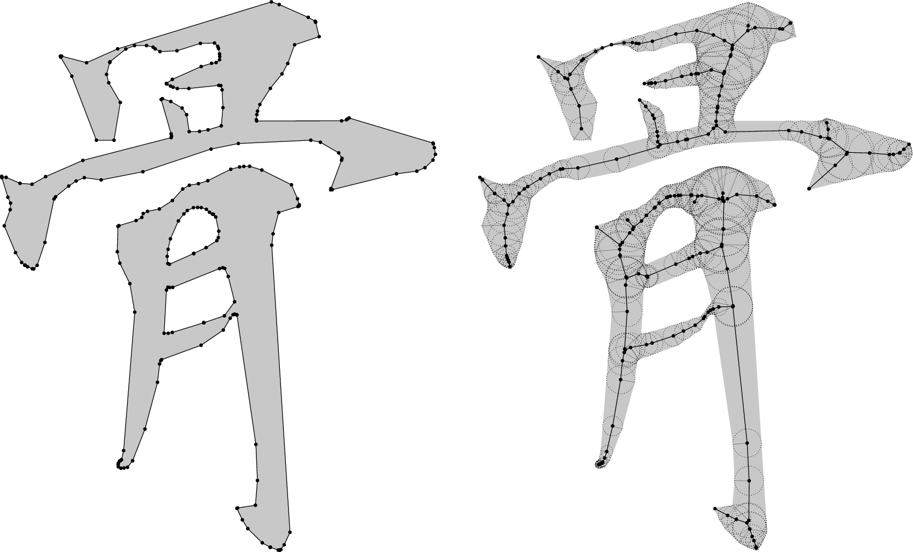

# polygonskeletons

A python module to compute straight skeletons using [CGAL's algorithm][cgal-skeletons].

The `polygonskeletons.skeleton_cgal(polygons)` python function makes a `subprocess` call to a CGAL executable to process the data.
This executable is compiled at install time, meaning `cmake`, `make`, and the CGAL dev files are required for `setup.py` to work.

## Improvements to be made
- [x] accept polygon soups as input
- [x] examples
- [ ] choice of EpIc or EpEc kernel at runtime
- [ ] improve `setup.py`
- [ ] maybe proper documentation?
- [ ] see if CGAL code can be made prettier with more c++11 stuff
- [ ] use boost::python instead of executable + subprocess

[cgal-skeletons]: http://doc.cgal.org/latest/Straight_skeleton_2/index.html
